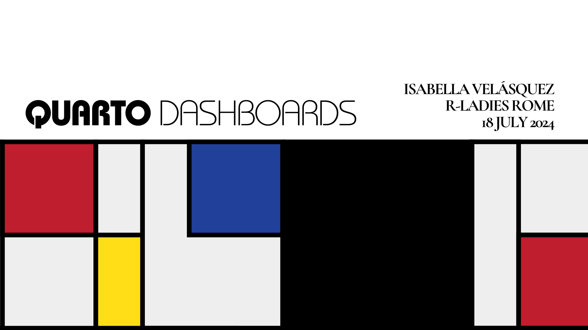

# Quarto Dashboards
## 2024-07-18 R-Ladies Rome webinar

## Resources

### Quarto

* [Quarto](https://quarto.org/)
* [Intro to Quarto] by Isabella Velásquez for R-Ladies St. Louis
* [Awesome Quarto](https://github.com/mcanouil/awesome-quarto)
* [Building a Website in R](https://www.youtube.com/watch?v=ZTyKEmCyYiI) by Federica Gazzelloni for R-Ladies New York
* [Building a blog with Quarto](https://www.youtube.com/watch?v=CVcvXfRyfE0) by Isabella Velásquez for RStudio Enterprise Meetup
* [Styling and Templating Quarto Documents - posit::conf(2023)](https://www.youtube.com/watch?v=CblUFMoC9yg) by Emil Hvitfeldt

### Quarto Dashboards

* [Quarto Dashboard YouTube video](https://www.youtube.com/watch?v=_VGJIPRGTy4) by Charles Teague

* [Dashing through the snow ❄️ (or Sharing your data) in a Quarto Dashboard](https://mine.quarto.pub/quarto-dashboards-pydata/#/title-slide) by  Mine Çetinkaya-Rundel